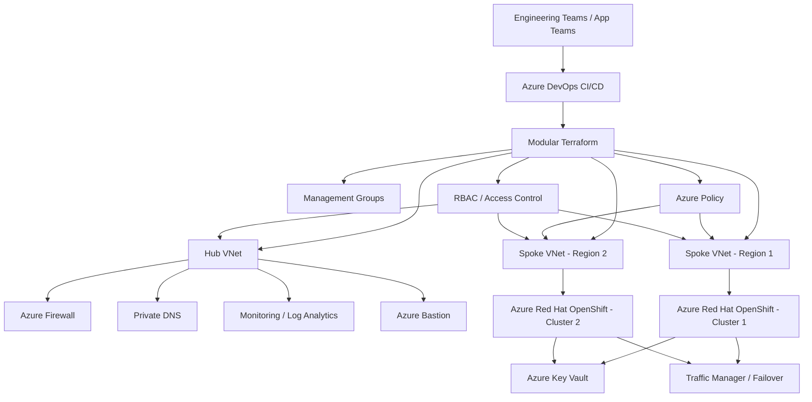

# How-to-be-a-Platform-DevOps-Engineer-Series
A practical, step-by-step playbook for learning how to think, design and build like a Platform / DevOps Engineer in enterprise environments. This series is meant to help newcomers understand **what to do, why it matters and how to implement it** without confusion, using clear sequencing, architecture notes, code snippets and linked documentation.

## Start here

If you are new to platform engineering or DevOps, follow this order:

1. Read the overview.
2. Review the architecture.
3. Check prerequisites.
4. Follow the implementation steps.
5. Explore Terraform and CI/CD examples.
6. Review the security, governance, and networking sections.
7. Read the challenges and lessons learned.

## Table of contents

- [Series Overview](#series-overview)
- [What This Series Covers](#what-this-series-covers)
- [Suggested Repository Structure](#suggested-repository-structure)
- [Architecture Overview](#architecture-overview)
- [Deployment Prerequisites](#deployment-prerequisites)
- [Step-by-Step Journey](#step-by-step-journey)
- [Security and Governance](#security-and-governance)
- [Terraform and Automation](#terraform-and-automation)
- [Technical Challenges](#technical-challenges)
- [Lessons Learned](#lessons-learned)
- [Suggested Docs Structure](#suggested-docs-structure)
- [How to Navigate This Repo](#how-to-navigate-this-repo)
- [License](#license)

## Series Overview

This repository is designed as a practical learning series for engineers who want to build enterprise-grade Azure platforms with a strong focus on cloud networking, security, governance, Terraform and Azure DevOps CI/CD.

The goal is to show how real platform engineering is done in production environments:
- how to plan the foundation,
- how to build securely,
- how to scale across teams and regions,
- how to automate delivery,
- and how to keep the platform reliable, compliant and cost-aware.

## What This Series Covers

This series focuses on the skills and practices commonly expected from a strong Platform / DevOps Engineer:

- Azure landing zones.
- Hub-spoke networking.
- Private connectivity and network segmentation.
- Azure Policy and governance.
- Multi-region and multi-cluster design.
- Azure Red Hat OpenShift platform deployment.
- Modular Terraform design.
- Remote state management.
- Azure DevOps YAML pipelines.
- Secure application deployment.
- Secrets management.
- Observability and operational readiness.
- Cost optimisation and FinOps practices.

## Suggested Repository Structure

```text
How-to-be-a-Platform-DevOps-Engineer-Series/
├── README.md
├── docs/
│   ├── 01-series-overview.md
│   ├── 02-architecture-overview.md
│   ├── 03-deployment-prerequisites.md
│   ├── 04-step-by-step-journey.md
│   ├── 05-security-and-governance.md
│   ├── 06-terraform-and-automation.md
│   ├── 07-technical-challenges.md
│   ├── 08-lessons-learned.md
│   └── diagrams/
│       └── landing-zone-architecture.png
├── terraform/
│   ├── bootstrap/
│   ├── modules/
│   │   ├── hub-network/
│   │   ├── spoke-network/
│   │   ├── policy/
│   │   ├── openshift/
│   │   ├── security/
│   │   └── monitoring/
│   └── environments/
│       ├── dev/
│       ├── test/
│       └── prod/
├── pipelines/
│   └── azure-pipelines.yml
└── scripts/
    ├── validate.sh
    └── cleanup.sh
```

## Architecture Overview

This series is based on an enterprise Azure landing zone built for regulated environments with multi-team, multi-region and multi-cluster requirements.

The platform is designed with:
- a central hub for shared services,
- isolated spoke networks for workload boundaries,
- private connectivity by default,
- centralised governance using Azure Policy,
- modular Terraform for repeatability,
- and secure CI/CD for infrastructure and application deployment.

### Architecture diagram



## Deployment Prerequisites

Before starting, make sure the following are ready:

- Azure subscription access with permissions to create networking, policies and platform resources.
- Clear naming standards and tagging conventions.
- Approved IP address ranges and subnet plan.
- Management group structure defined.
- Azure DevOps project and service connections configured.
- Terraform installed locally or available in the pipeline.
- Azure Storage account for Terraform remote state.
- Identity and RBAC model agreed.
- Key Vault strategy for secrets and certificates.
- Azure Red Hat OpenShift capacity and region planning completed.
- Logging and monitoring destination identified.

## Step-by-Step Journey

### 1. Define the target state

Start by understanding the business goal, security expectations, compliance requirements and availability needs. This helps you avoid building a technically correct platform that does not solve the actual problem.

### 2. Design the landing zone

Create the Azure foundation first:
- management groups,
- subscriptions,
- policies,
- network boundaries,
- identity controls,
- and logging standards.

This is where enterprise thinking matters most. You are not just deploying resources; you are defining the control plane for all future workloads.

### 3. Build the hub network

Set up the shared-services hub for:
- firewall,
- DNS,
- monitoring,
- secure administration,
- and controlled connectivity.

This becomes the central trust and routing layer for the platform.

### 4. Add spoke networks

Create isolated spokes for workloads and clusters. Keep them separate so teams can move independently without interfering with each other.

### 5. Deploy OpenShift securely

Build Azure Red Hat OpenShift in a private, governed and scalable model. Make sure clusters are connected through private routing and protected by platform controls.

### 6. Automate with Terraform

Use modular Terraform to avoid copy-paste infrastructure. Each module should handle one logical responsibility, such as networking, policy, security, or OpenShift.

### 7. Add Azure DevOps pipelines

Automate validation, plan and deployment through YAML pipelines. Use approvals and environment gates for production.

### 8. Enforce governance

Apply Azure Policy and RBAC so the platform remains compliant as teams begin using it.

### 9. Validate failover and observability

Test region failover, logging, alerting and recovery flows before calling the platform production-ready.

## Security and Governance

Security is built into the platform from the beginning, not added later.

The platform follows these principles:
- private access over public exposure,
- least privilege access,
- policy-driven compliance,
- secure secrets handling,
- controlled ingress and egress,
- and audit-friendly design.

This section should cover:
- Azure Policy,
- RBAC,
- private endpoints,
- network security groups,
- firewall routing,
- certificate handling,
- and Key Vault integration.

## Terraform and Automation

Terraform is used to make the platform repeatable, auditable and scalable.

Recommended module boundaries:
- `hub-network`
- `spoke-network`
- `policy`
- `openshift`
- `security`
- `monitoring`

Each module should include:
- variables,
- outputs,
- README,
- examples,
- and clear dependencies.

Remote state should be stored centrally and locked to prevent accidental conflicts. Use separate state files for separate layers of the platform.

## Technical Challenges

This series should also cover the real-world problems that usually appear in enterprise environments:

- building for scale without losing control,
- balancing governance with speed,
- keeping secrets out of pipelines and repositories,
- designing for failover across regions,
- avoiding Terraform state sprawl,
- reducing cost without hurting reliability,
- and supporting multiple teams in the same platform.

These are the problems that make the work interesting and also show real platform engineering depth.

## Lessons Learned

- Good architecture starts with boundaries.
- Private-by-default platforms are easier to govern.
- Modular infrastructure is easier to operate.
- Policies should prevent issues, not just report them.
- CI/CD should be a control system, not only a delivery system.
- Failover must be tested, not assumed.
- Platform engineering is about enabling teams safely at scale.

## Suggested Docs Structure

Use the `docs/` folder to keep the README concise and the learning path clear.

### `docs/01-series-overview.md`
Explains the purpose of the series, target audience and learning path.

### `docs/02-architecture-overview.md`
Describes the platform design, architecture choices and diagram.

### `docs/03-deployment-prerequisites.md`
Lists all dependencies, permissions, tools and setup requirements.

### `docs/04-step-by-step-journey.md`
Walks through the build in sequence, from foundation to deployment.

### `docs/05-security-and-governance.md`
Covers Azure Policy, RBAC, private networking and compliance controls.

### `docs/06-terraform-and-automation.md`
Explains module structure, state management and pipeline integration.

### `docs/07-technical-challenges.md`
Document issues encountered and how they were solved.

### `docs/08-lessons-learned.md`
Summarises practical takeaways and engineering principles.

## How to Navigate This Repo

Use the README as the entry point, then follow the documentation in order.

Recommended reading order:
1. [Series Overview](docs/01-series-overview.md)
2. [Architecture Overview](docs/02-architecture-overview.md)
3. [Deployment Prerequisites](docs/03-deployment-prerequisites.md)
4. [Step-by-Step Journey](docs/04-step-by-step-journey.md)
5. [Security and Governance](docs/05-security-and-governance.md)
6. [Terraform and Automation](docs/06-terraform-and-automation.md)
7. [Technical Challenges](docs/07-technical-challenges.md)
8. [Lessons Learned](docs/08-lessons-learned.md)


