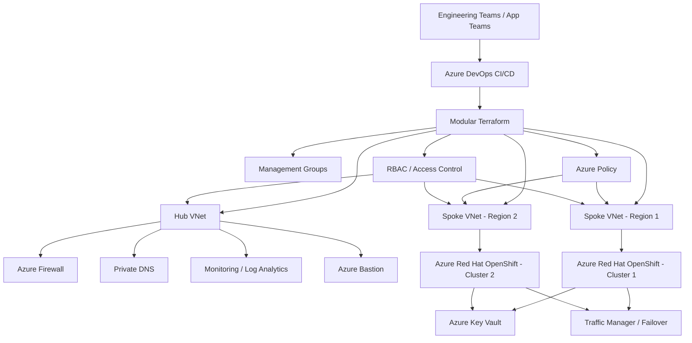

# Architecture Overview

This document explains the target platform architecture and the reasoning behind the design choices.

The platform is built as an enterprise Azure landing zone for multi-team, multi-region, and multi-cluster workloads. It uses a hub-spoke topology, centralized governance, private connectivity, and modular infrastructure automation to support production-ready delivery [web:30][web:50].

## Architecture goals

The architecture is designed to achieve the following outcomes:
- Secure by default.
- Scalable across teams and workloads.
- Ready for regulated enterprise use.
- Repeatable through infrastructure as code.
- Resilient across regions.
- Easy to govern and operate.

## High-level design

The platform is organised into three major layers:

### 1. Governance layer
This layer contains management groups, policies, RBAC, and compliance controls. Its purpose is to define guardrails before workloads are deployed.

### 2. Connectivity layer
This layer contains the hub network, firewall, routing, DNS, and private connectivity services. It provides controlled access and shared platform capabilities.

### 3. Workload layer
This layer contains spoke networks, Azure Red Hat OpenShift clusters, application workloads, and environment-specific resources.

## Reference architecture

## Why this design

### Hub-spoke networking
Hub-spoke is a standard enterprise pattern in Azure because it separates shared services from application workloads while keeping connectivity manageable. 
The hub becomes the central point for inspection, routing, and shared services, while spokes remain isolated for security and operational clarity.

### Private-first connectivity
Private connectivity reduces exposure and improves control. This is especially important for regulated environments where public access should be minimised.

### Centralised governance
Governance is applied at the platform level, so every downstream workload inherits the same baseline controls. This allows teams to move faster without bypassing policy.

### Modular Terraform
Terraform modules make the platform easier to maintain, test, and extend. Each module should represent one clear responsibility so the code stays understandable and reusable.

## Core platform components

### Management groups
Management groups define where policies and access controls are applied. They create a scalable governance model for multiple subscriptions.

### Hub network
The hub contains shared services such as:
- Azure Firewall.
- Private DNS.
- Azure Bastion.
- Monitoring and logging.
- Controlled routing.

### Spoke networks
Spokes are used for isolated workloads and environment separation. They support team autonomy while maintaining platform standards.

### Azure Red Hat OpenShift
OpenShift hosts containerised workloads securely and consistently. The platform is designed to support private access, secure deployment, and multi-region resilience.

### Azure Policy
Policies enforce security and compliance rules, such as:
- approved regions,
- required tags,
- encryption requirements,
- no public endpoints,
- and controlled resource usage [web:39][web:40].

### Terraform and Azure DevOps
Terraform is used to provision and manage infrastructure. Azure DevOps pipelines are used to validate, plan, and deploy changes in a controlled way.

## Design principles

The platform follows these design principles:
- Build security into the foundation.
- Separate platform concerns from workload concerns.
- Keep the architecture simple enough to operate at scale.
- Automate everything repeatable.
- Use policy instead of manual review wherever possible.
- Design for failover and operational recovery from the start.

## What makes this architecture production-ready

A production-ready architecture is not just functional. It must also be:
- secure,
- auditable,
- observable,
- recoverable,
- and maintainable by multiple teams.

This is why the design includes governance, private networking, monitoring, failover planning, and modular code structure.

## Next step

After understanding the architecture, continue to:
1. Review the deployment prerequisites.
2. Follow the step-by-step implementation guide.
3. Study the security and governance section.
4. Review the Terraform and CI/CD automation approach.
